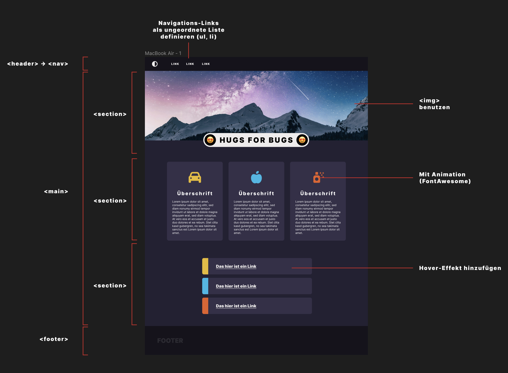

# Figma Web-Design & Web-Development

Eure Aufgabe ist es die illustrierte Webseite nachzubauen.

In Figma könnt ihr euch alle Details anschauen: [Figma-Design](https://www.figma.com/design/EAjD82Zhd7KvZnma9DNeoi/Hugs-For-Bugs?node-id=0%3A1&t=gjn9lKgCoQN9BE3s-1)

Die verwendete Schrift ist [Inter](https://fonts.google.com/specimen/Inter).
Die Icons sind von [FontAwesome](https://fontawesome.com/).

Schriftgrößen, Schriftarten & Abstände könnt ihr aus dem Figma-Design entnehmen. Es ist nicht notwendig pixel-perfekt zu arbeiten, aber gebt euch Mühe nah an das Design ranzukommen ;)

Viel Spaß!

